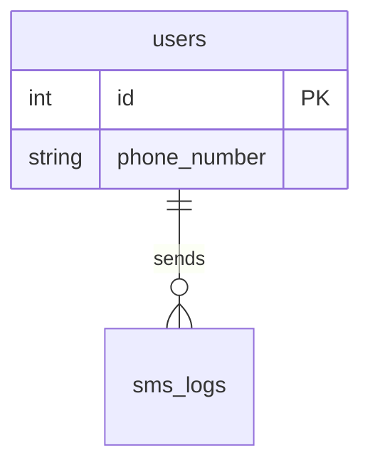

# Documentation Standards & Diagrams

## Documentation Rules

- **User-facing docs**: Keep `README.md` updated with installation, configuration, public interfaces/APIs, and usage instructions.
- **Developer-facing docs**: Keep `DEV_README.md` updated with architectural overviews, development setup, workflow, and testing strategies.
- **Continuous Documentation Synchronization**: Whenever implementing new features, components, endpoints, database tables, or data models, you MUST update relevant documentation (`README.md`, `DEV_README.md`, `docs/*`, schema diagrams) in the same PR before completing the task. Never leave documentation out of sync with newly introduced functionality or models.

## Mermaid Diagrams

Use Mermaid diagrams for visual documentation of schemas, architecture, and interaction flows.

### Mermaid `erDiagram` Rules
Mermaid `erDiagram` is sensitive to syntax:

- **Single physical line**: ALL relationship declarations MUST be written on a single physical line without line breaks inside the definition.
- **Tabs**: Avoid tabs in Mermaid diagrams; use standard spaces.
- **Labels**: Prefer simple ASCII labels (e.g., `contains`, `belongs_to`, `has_many`, `references`, `targets`). Avoid quotes unless required.

#### Correct Example:

